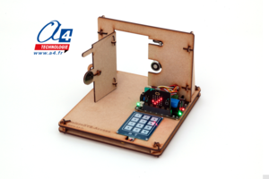
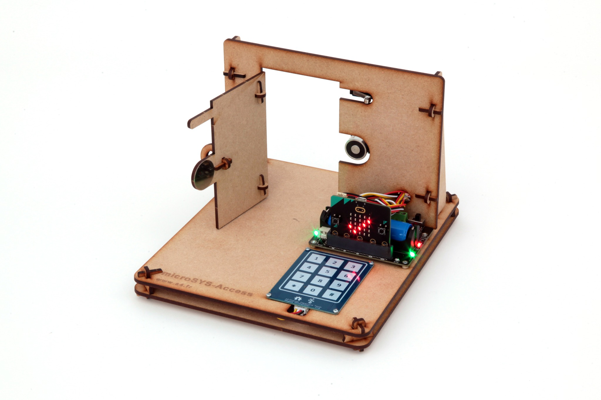
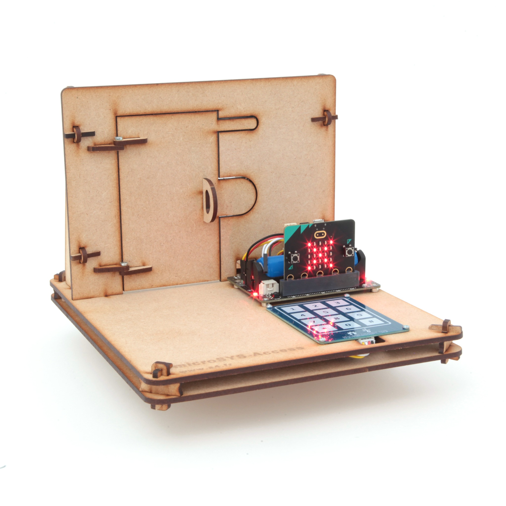

# a4-microsystem-access



MakeCode extension for the **A4 Technologie microSySTEM-Access** educational access-control model for **BBC micro:bit**.

The microSySTEM-Access reproduces the secured entrance to a building or restricted area. Students can enter a code on a capacitive keypad, control a magnetic door lock and check whether the door is open or closed.

## Product and educational use

The model is designed for technology and computer science education. It can be used to study:

- automated access-control systems;
- information and energy chains;
- sensors, actuators and user interfaces;
- conditional programming and character strings;
- password validation;
- state-based control sequences and door safety logic.

**Product page:**
https://www.a4.fr/access-maquette-programmable-microsystem-pour-micro-bit.html

**Manufacturer:**
https://www.a4.fr

## Hardware

The microSySTEM-Access model uses:

- **BBC micro:bit** – program execution and user interface;
- **DFR1216 expansion board** – connection and power interface;
- **magnetic lock** – keeps the door locked while powered;
- **microswitch** – detects whether the door is closed;
- **12-key capacitive keypad** – sends the keys `0` to `9`, `*` and `#` over UART.

### Connections used by the extension

| Component | Connection |
|---|---|
| Magnetic lock | C0 on the DFR1216 board |
| Door microswitch | P0 |
| Keypad RX | P14 |
| Keypad TX | P15 |

> Initializing the keypad redirects the micro:bit serial port to P14/P15 at 9600 baud. Do not use another UART accessory at the same time.

### Model views

| Door open | Door closed |
|---|---|
|  |  |

## Add the extension in MakeCode

1. Open the [MakeCode editor for micro:bit](https://makecode.microbit.org/).
2. Create or open a project.
3. Select **Extensions**.
4. Paste the repository URL into the search field:

```text
https://github.com/A4-TECHNOLOGIE/a4-microSySTEM-Access
```

5. Select the **A4 microSySTEM Access** extension.

## Blocks / API

### Magnetic lock

```typescript
a4MicroSystemAccess.lockDoor()
a4MicroSystemAccess.unlockDoor()
```

The magnetic lock is connected to C0. It is powered to lock the door and switched off to release it.

### Door sensor

```typescript
a4MicroSystemAccess.doorIs(a4MicroSystemAccess.DoorState.Closed)
```

Returns `true` when the door matches the selected open or closed state.

### Keypad

```typescript
a4MicroSystemAccess.initializeKeypad()
a4MicroSystemAccess.waitForKey()
```

`waitForKey()` pauses the current program flow until a key is received.

The event block provides the pressed character directly:

```typescript
a4MicroSystemAccess.onKeyPressed(function (key) {
    basic.showString(key)
})
```

### Access code

The extension automatically stores numeric keys in a code of up to 16 digits. The `*` key clears it; the `#` key can be used to validate it and is not added to the code.

```typescript
a4MicroSystemAccess.getEnteredCode()
a4MicroSystemAccess.enteredCodeIs("1234")
a4MicroSystemAccess.enteredCodeHasLength(4)
a4MicroSystemAccess.deleteLastCharacter()
a4MicroSystemAccess.clearEnteredCode()
```

Use `enteredCodeHasLength()` to reject and clear an incorrect entry as soon as the expected number of digits has been entered:

```typescript
if (a4MicroSystemAccess.enteredCodeIs("1234")) {
    // Access granted
    a4MicroSystemAccess.clearEnteredCode()
} else if (a4MicroSystemAccess.enteredCodeHasLength(4)) {
    // Access denied
    a4MicroSystemAccess.clearEnteredCode()
}
```

## Example: four-digit access code

This program keeps the door locked. Enter `1234#` to release it. The door locks again after it has been opened and then closed.

```typescript
a4MicroSystemAccess.lockDoor()
a4MicroSystemAccess.initializeKeypad()

a4MicroSystemAccess.onKeyPressed(function (key) {
    if (key == "#") {
        if (a4MicroSystemAccess.enteredCodeIs("1234")) {
            basic.showIcon(IconNames.Yes)
            a4MicroSystemAccess.unlockDoor()

            while (a4MicroSystemAccess.doorIs(a4MicroSystemAccess.DoorState.Closed)) {
                basic.pause(50)
            }

            while (a4MicroSystemAccess.doorIs(a4MicroSystemAccess.DoorState.Open)) {
                basic.pause(50)
            }

            a4MicroSystemAccess.lockDoor()
        } else {
            basic.showIcon(IconNames.No)
        }

        a4MicroSystemAccess.clearEnteredCode()
    }
})
```

## Testing

The compile test and complete hardware procedure are described in [TESTING.md](TESTING.md).

## License

This extension is released under the **MIT License**. See [LICENSE](LICENSE).

## A4 Technologie

Designed for educational use by **A4 Technologie**.
https://www.a4.fr

---

for PXT/microbit
